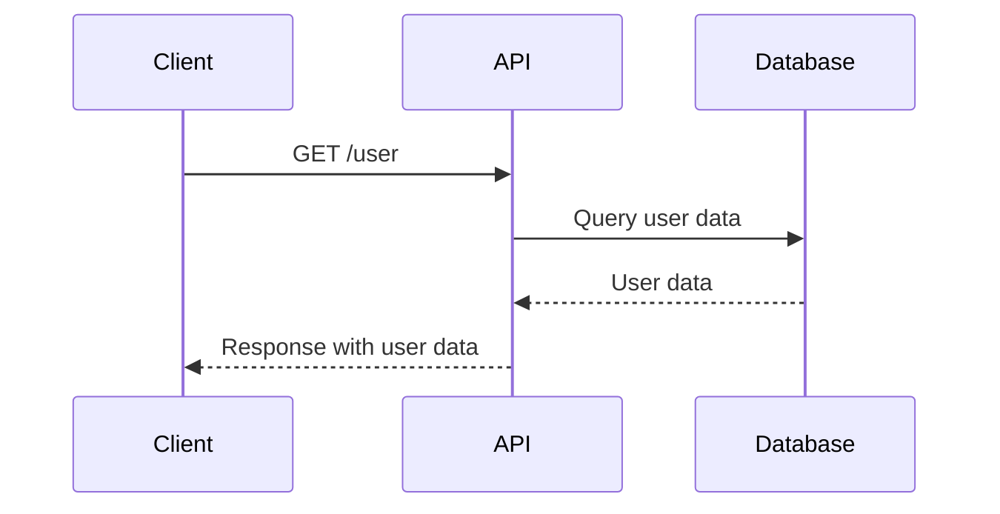
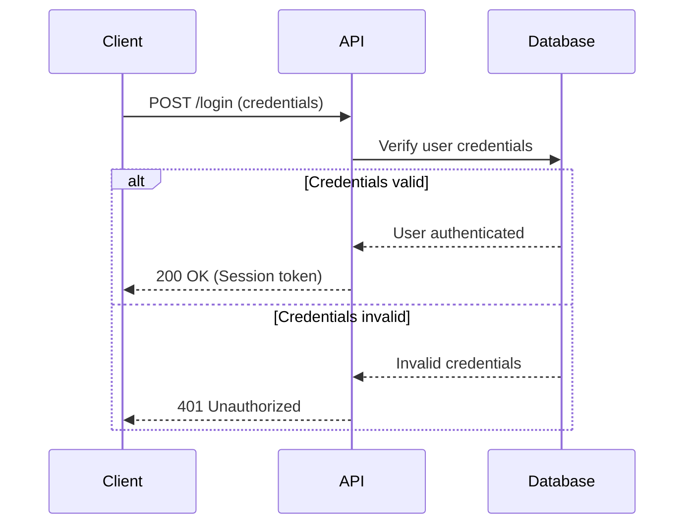
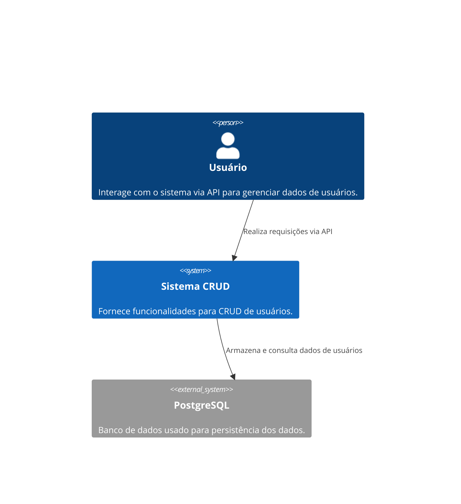
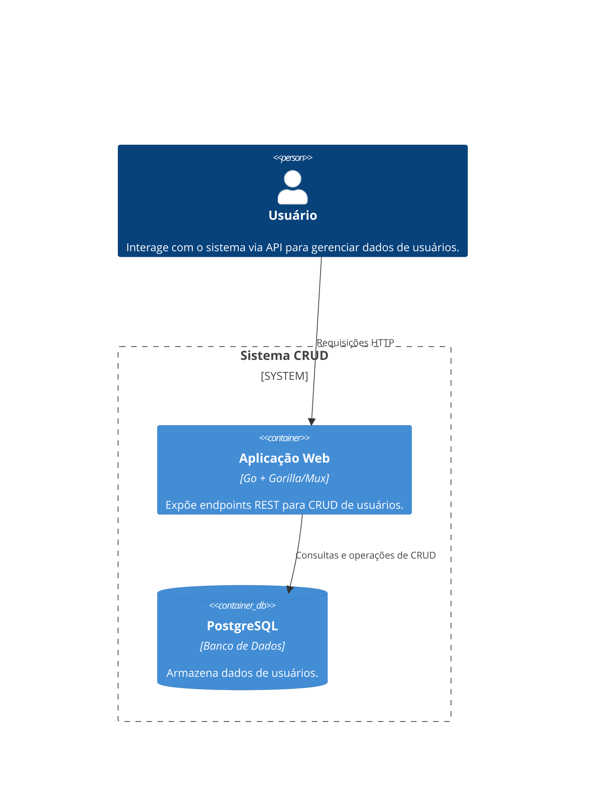
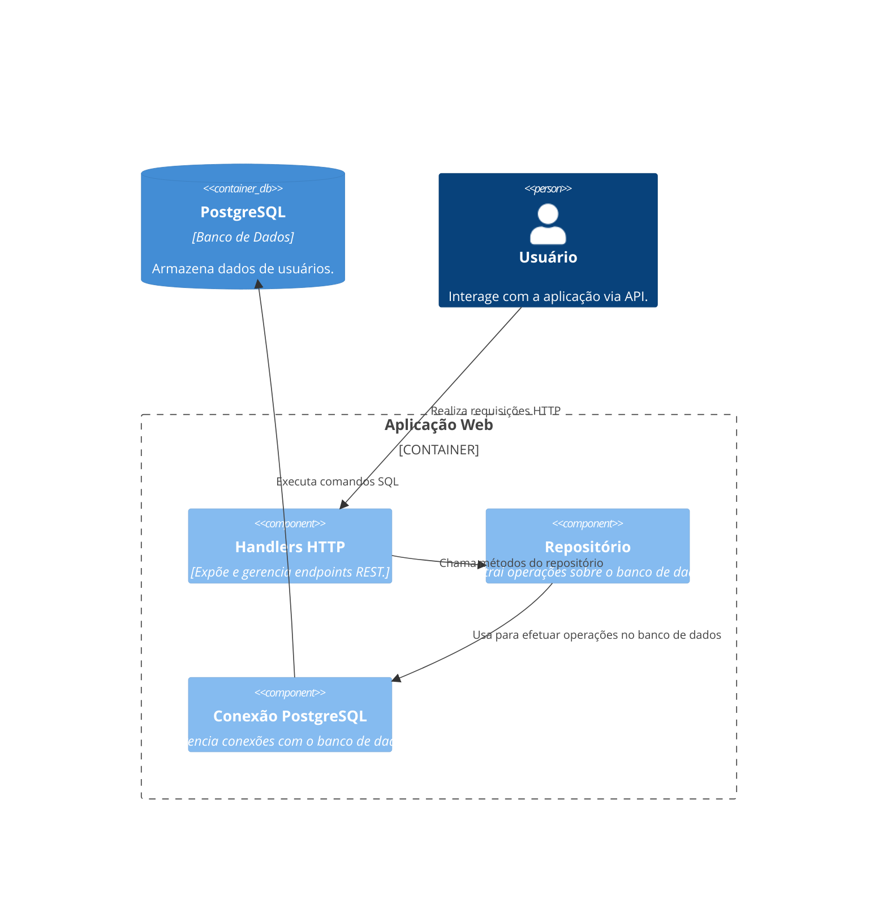
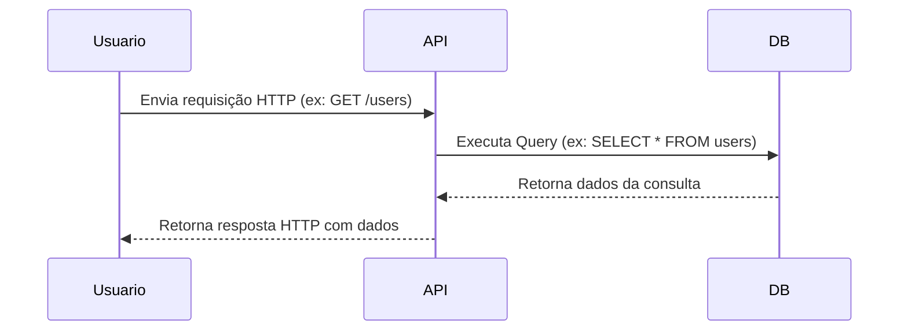

# CRUD SIMPLE

## Suba o PostgreSQL (exemplo com Docker):
```bash
  docker run --name my-postgres -e POSTGRES_USER=user -e POSTGRES_PASSWORD=password -e POSTGRES_DB=dbname -p 5432:5432 -d postgres
```

## Código SQL
```sql
CREATE TABLE users (
   id SERIAL PRIMARY KEY,          -- ID único, auto-incrementado
   name VARCHAR(100) NOT NULL,     -- Nome do usuário, obrigatório
   email VARCHAR(150) NOT NULL,    -- E-mail do usuário, obrigatório
   created_at TIMESTAMP NOT NULL DEFAULT NOW() -- Data/hora de criação, padrão para horário atual
);
```

## Teste as rotas:
### Criar usuário:
```bash
curl -X POST -H "Content-Type: application/json" -d '{"name": "John", "email": "john@example.com"}' http://localhost:8080/users
Listar usuários:
```
### Listar usuários:
```bash
curl http://localhost:8080/users
```

# Diagramas de Sequência

## Endpoint: GET /user



---

## Endpoint: POST /login



# Diagrama C4 - Representação em Mermaid

## Contexto - Sistema CRUD com PostgreSQL



---

## Container - Estrutura do Sistema CRUD



---

## Componente - Detalhes da Aplicação



---

## Código - Fluxo de Controle



---

### Explicação dos elementos

1. **Diagrama de Contexto**:
    - Mostra como os usuários interagem com o sistema e como este se conecta ao banco PostgreSQL.

2. **Diagrama de Container**:
    - Detalha os principais componentes, destacando a aplicação feita em Go que interage com o banco de dados.

3. **Diagrama de Componente**:
    - Divide a aplicação Go em partes específicas:
        - `Handlers HTTP`: Responsáveis pelos endpoints REST.
        - `Repositórios`: Abstrações para acesso ao banco.
        - `Conexões com o Banco`: Gerenciamento direto das transações no PostgreSQL.

4. **Diagrama de Sequência**:
    - Explica o fluxo de uma requisição, desde o cliente até as interações no banco, e a resposta ao cliente.

Se precisar de algo mais específico ou detalhado, como adicionar mais elementos ou melhorar o contexto para sua aplicação, basta avisar! 😊

## Estrutura Final do Projeto
```text
go-crud-postgres/
├── database/
│   └── database.go
├── models/
│   └── models.go
├── repository/
│   └── repository.go
├── handlers/
│   └── handlers.go
├── go.mod
├── go.sum
└── main.go
```

# go-crud-postgres
